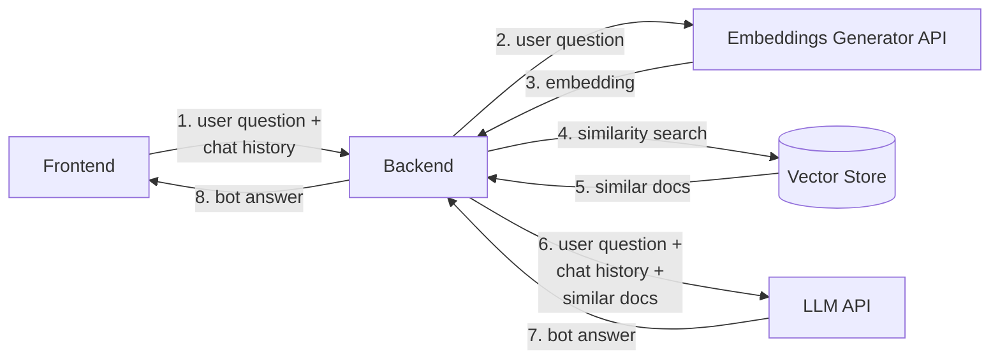

# ai-rag-template

[](.coverage/html/index.html)
[](.coverage/html/index.html)

---

`ai-rag-template` is a template meant to be a based for the implementation of a RAG (retrieval augmented generation) system.  
This repository contains the backend code, which consists of a web server that provides REST APIs to primarily support one type of operation:

- **Chat**: Provides a conversation feature, allowing users to ask questions and get responses from the chatbot.

The backend was developed using the [LangChain](https://python.langchain.com/docs/get_started/introduction/) framework, which enables creating sequences of complex interactions using Large Language Models. The web server was implemented using the [FastAPI](https://fastapi.tiangolo.com/) framework.

More information on how the service works can be found in the [Overview and Usage](./docs/10_Overview_And_Usage.md) page.

## Main Features

### Chat Endpoint (`/chat/completions`)

The `/chat/completions` endpoint generates responses to user queries based on provided context and chat history. It leverages information from the configured Vector Store to formulate relevant responses, enhancing the conversational experience.

***Eg***:

<details>
<summary>Request</summary>

```curl
curl 'http://localhost:3000/chat/completions' \
  -H 'content-type: application/json' \
  --data-raw '{"chat_query":"Design a CRUD schema for an online store selling merchandise items","chat_history":[]}'
```

</details>

<details>
<summary>Response</summary>

```json
{
    "message": "For an online store selling merchandise items, we can design a CRUD schema for a `Product` entity with the following properties:\n\n- `name`: A mandatory string.\n- `description`: An optional string.\n- `price`: A mandatory number.\n\nThe CRUD schema, excluding the default attributes, would look like this:\n\n```json\n[\n  {\n    \"name\": \"name\",\n    \"type\": \"string\",\n    \"required\": true,\n    \"nullable\": false,\n    \"encryptionEnabled\": false,\n    \"encryptionSearchable\": false,\n    \"sensitivityValue\": 0\n  },\n  {\n    \"name\": \"price\",\n    \"type\": \"number\",\n    \"required\": true,\n    \"nullable\": false,\n    \"encryptionEnabled\": false,\n    \"encryptionSearchable\": false,\n    \"sensitivityValue\": 0\n  },\n  {\n    \"name\": \"description\",\n    \"type\": \"string\",\n    \"required\": false,\n    \"nullable\": false,\n    \"encryptionEnabled\": false,\n    \"encryptionSearchable\": false,\n    \"sensitivityValue\": 0\n  }\n]\n```\n\nThis schema defines the structure of the `Product` entity with the necessary properties for managing merchandise items in the online store.",
    "references": [
        {
            "content": "### Create CRUD to Read and Write Table Data  \nTo evaluate the new page, it's essential to create a CRUD microservice and expose the relevant data through an endpoint, facilitating reading and writing operations on our table.  \n:::warning\nIf you're unfamiliar with CRUD microservices, consider consulting the [CRUD Tutorial](/console/tutorials/configure-marketplace-components/rest-api-for-crud-on-data.mdx).\n:::  \nFor our example, let's employ a basic CRUD microservice featuring a `Product` entity endowed with the subsequent properties:\n* `name`: A mandatory string.\n* `description`: An optional string.\n* `price`: A mandatory number.  \nThe data CRUD will be exposed via an endpoint named `products`.  \nBelow is the CRUD schema, excluding the default CRUD attributes (_id, creatorId, createdAt, updaterId, updatedAt, and \\_\\_STATE\\_\\_):  \n```json\n[\n{\n\"name\":\"name\",\n\"type\":\"string\",\n\"required\":true,\n\"nullable\":false,\n\"encryptionEnabled\":false,\n\"encryptionSearchable\":false,\n\"sensitivityValue\":0\n},\n{\n\"name\":\"price\",\n\"type\":\"number\",\n\"required\":true,\n\"nullable\":false,\n\"encryptionEnabled\":false,\n\"encryptionSearchable\":false,\n\"sensitivityValue\":0\n},\n{\n\"name\":\"description\",\n\"type\":\"string\",\n\"required\":false,\n\"nullable\":false,\n\"encryptionEnabled\":false,\n\"encryptionSearchable\":false,\n\"sensitivityValue\":0\n}\n]\n```\nNow, the CRUD data can be exposed using an endpoint named `products`.",
            "url": "https://docs.mia-platform.eu/docs/microfrontend-composer/tutorials/basics"
        },
        {
            "content": "### Create CRUD to Read and Write Table Data  \nTo evaluate the new page, it's essential to create a CRUD microservice and expose the relevant data through an endpoint, facilitating reading and writing operations on our table.  \n:::warning\nIf you're unfamiliar with CRUD microservices, consider consulting the [CRUD Tutorial](/console/tutorials/configure-marketplace-components/rest-api-for-crud-on-data.mdx).\n:::  \nFor our example, let's employ a basic CRUD microservice featuring a `Product` entity endowed with the subsequent properties:\n* `name`: A mandatory string.\n* `description`: An optional string.\n* `price`: A mandatory number.  \nThe data CRUD will be exposed via an endpoint named `products`.  \nBelow is the CRUD schema, excluding the default CRUD attributes (_id, creatorId, createdAt, updaterId, updatedAt, and \\_\\_STATE\\_\\_):  \n```json\n[\n{\n\"name\":\"name\",\n\"type\":\"string\",\n\"required\":true,\n\"nullable\":false,\n\"encryptionEnabled\":false,\n\"encryptionSearchable\":false,\n\"sensitivityValue\":0\n},\n{\n\"name\":\"price\",\n\"type\":\"number\",\n\"required\":true,\n\"nullable\":false,\n\"encryptionEnabled\":false,\n\"encryptionSearchable\":false,\n\"sensitivityValue\":0\n},\n{\n\"name\":\"description\",\n\"type\":\"string\",\n\"required\":false,\n\"nullable\":false,\n\"encryptionEnabled\":false,\n\"encryptionSearchable\":false,\n\"sensitivityValue\":0\n}\n]\n```\nNow, the CRUD data can be exposed using an endpoint named `products`.",
            "url": "https://docs.mia-platform.eu/docs/microfrontend-composer/tutorials/basics"
        },
        {
            "content": "### Create a CRUD for persistency  \nTo create a CRUD service you can follow [this](/console/tutorials/configure-marketplace-components/rest-api-for-crud-on-data.mdx) tutorial.\nAs data schema please import this <a download target=\"_blank\" href=\"/docs_files_to_download/flow-manager-service/saga-collection.json\">schema</a>.  \nRemember to create a **unique index** for the collection on the `sagaId` field and to set the **default state** for new documents to `PUBLIC`.  \nTo do this follow these steps:\n1. Open the _Design_ section of the Console.\n1. On the left panel, in the _Data Models_ group, click on _MongoDB CRUD_ section.\n1. Click on the CRUD you created.\n1. In the _Indexes_ section click _Add index_.\n1. Enter these values:\n- **Name**: `sagaIdIndex`\n- **Type**: `Normal`\n- **Field**: `sagaId`  \n<div style={{display: 'flex', justifyContent: 'center'}}>\n<div style={{display: 'flex', width: '600px'}}>  \n  \n</div>\n</div>  \n1. Click _Create_. The new index will be shown.\n1. Set the `unique` checkbox for the `sagaIdIndex` index.\n1. In the _Internal Endpoints_ section make sure that `Default state` is set to `PUBLIC`.  \n<div style={{display: 'flex', justifyContent: 'center'}}>\n<div style={{display: 'flex', width: '600px'}}>  \n  \n</div>\n</div>  \nYou can find more information on CRUD Persistency Manager in the [dedicated](/runtime_suite/flow-manager-service/30_configuration.md#crud-persistency-manager) page.",
            "url": "https://docs.mia-platform.eu/docs/console/tutorials/configure-marketplace-components/flow-manager"
        },
        {
            "content": "### Create a CRUD for persistency  \nTo create a CRUD service you can follow [this](/console/tutorials/configure-marketplace-components/rest-api-for-crud-on-data.mdx) tutorial.\nAs data schema please import this <a download target=\"_blank\" href=\"/docs_files_to_download/flow-manager-service/saga-collection.json\">schema</a>.  \nRemember to create a **unique index** for the collection on the `sagaId` field and to set the **default state** for new documents to `PUBLIC`.  \nTo do this follow these steps:\n1. Open the _Design_ section of the Console.\n1. On the left panel, in the _Data Models_ group, click on _MongoDB CRUD_ section.\n1. Click on the CRUD you created.\n1. In the _Indexes_ section click _Add index_.\n1. Enter these values:\n- **Name**: `sagaIdIndex`\n- **Type**: `Normal`\n- **Field**: `sagaId`  \n<div style={{display: 'flex', justifyContent: 'center'}}>\n<div style={{display: 'flex', width: '600px'}}>  \n  \n</div>\n</div>  \n1. Click _Create_. The new index will be shown.\n1. Set the `unique` checkbox for the `sagaIdIndex` index.\n1. In the _Internal Endpoints_ section make sure that `Default state` is set to `PUBLIC`.  \n<div style={{display: 'flex', justifyContent: 'center'}}>\n<div style={{display: 'flex', width: '600px'}}>  \n  \n</div>\n</div>  \nYou can find more information on CRUD Persistency Manager in the [dedicated](/runtime_suite/flow-manager-service/30_configuration.md#crud-persistency-manager) page.",
            "url": "https://docs.mia-platform.eu/docs/console/tutorials/configure-marketplace-components/flow-manager"
        }
    ]
}
```

</details>

### Metrics Endpoint (`/-/metrics`)

The `/-/metrics` endpoint exposes the metrics collected by Prometheus.

## High Level Architecture

The following is the high-level architecture of ai-rag-template.



## Vector Index

The application will check if the collection includes at Vector Search Index at startup. If it does not find it, it will create a new one. If there's already one, it will try to update if notices that there any difference between the existing one and the one based on the values included in the [configuration](#configuration) file.

The Vector Search Index will have the following structure:

```json
{
  "fields": [
    {
      "numDimensions": <numDimensions>,
      "path": "<embeddingKey>",
      "similarity": "<relevanceScoreFn>",
      "type": "vector"
    }
  ]
}
```

The values `numDimensions`, `embeddingKey` and `relevanceScoreFn` comes from the [configuration file](#configuration). While `embeddingKey` and `relevanceScoreFn` comes exactly from the values included in the file, the `numDimensions` depends on the Embedding Model used (supported: `text-embedding-3-small` and `text-embedding-3-large`).

> **NOTE**
>
> In the event that an error occurs during the creation or update of the Vector Index, the exception will be logged, but the application will still start. However, the functioning of the service is not guaranteed.

## Configuration

The service requires several configuration parameters for execution. Below is an example configuration:

```json
{
  "llm": {
    "name": "gpt-3.5-turbo"
  },
  "embeddings": {
    "name": "text-embedding-3-small"
  },
  "vectorStore": {
    "dbName": "database-test",
    "collectionName": "assistant-documents",
    "indexName": "vector_index",
    "relevanceScoreFn": "euclidean",
    "embeddingKey": "embedding",
    "textKey": "text",
    "maxDocumentsToRetrieve": 4,
    "minScoreDistance": 0.5
  },
  "documentation": {
    "repository": {
      "baseUrl": "https://api.github.com/repos",
      "owner": "/mia-platform",
      "name": "/documentation",
      "baseDir": "docs",
      "supportedExtensions": [
        ".md",
        ".mdx"
      ],
      "requestTimeoutInSeconds": 30
    },
    "website": {
      "baseUrl": "https://docs.mia-platform.eu"
    }
  },
  "chain": {
    "aggregateMaxTokenNumber": 2000,
    "rag": {
      "promptsFilePath": {
        "system": "/path/to/system-prompt.txt",
        "user": "/path/to/user-prompt.txt"
      }
    }
  }
}
```

Description of configuration parameters:

| Param Name | Description |
|------------|-------------|
| LLM Name | Name of the chat model to use. [Must be supported by LangChain.](https://python.langchain.com/docs/integrations/chat/) |
| Embeddings Name | Name of the encoder to use. [Must be supported by LangChain.](https://python.langchain.com/docs/integrations/text_embedding/) |
| Vector Store DB Name | Name of the MongoDB database to use as a knowledge base. |
| Vector Store Collection Name | Name of the MongoDB collection to use for storing documents and document embeddings. |
| Vector Store Index Name | Name of the vector index to use for retrieving documents related to the user's query. The application will check at startup if a vector index with this name exists, it needs to be updated or needs to be created. |
| Vector Store Relevance Score Function | Name of the similarity function used for extracting similar documents using the created vector index. In case the existing vector index uses a different similarity function, the index will be updated using this as a similarity function. |
| Vector Store Embeddings Key | Name of the field used to save the semantic encoding of documents. In case the existing vector index uses a different key to store the embedding in the collection, the index will be updated using this as key. Please mind that any change of this value might require to recreate the embeddings. |
| Vector Store Text Key | Name of the field used to save the raw document (or chunk of document). |
| Vector Store Max. Documents To Retrieve | Maximum number of documents to retrieve from the Vector Store. |
| Vector Store Min. Score Distance | Minimum distance beyond which retrieved documents from the Vector Store are discarded. |
| Documentation Repository Base Url | Base path of the GitHub repository to download documentation from. |
| Documentation Repository Owner | Owner name of the documentation repository. |
| Documentation Repository Name | Name of the documentation repository. |
| Documentation Repository Base Dir. | Name of the folder containing the documentation source. |
| Documentation Repository Request Timeout In Seconds | Time limit to download a single documentation file. |
| Documentation Repository Supported Extensions | Name of supported file extensions (currently only Markdown files). |
| Chain RAG System Prompts File Path | ath to the file containing system prompts for the RAG model. |
| Chain RAG User Prompts File Path | Path to the file containing user prompts for the RAG model. |

## Local Development

- Before getting started, make sure you have the following information:
  - A valid connection string to connect to MongoDB Atlas
  - An OpenAI API Key to generate embeddings and contact the chat model (it's better to use two different keys)

- Copy the sample environment variables into a file used for development and replace the placeholders with your own values. As example you can create a file called `local.env` from `default.env` with the following command:

```sh
cp default.env local.env
```

- Modify the values of the environment variables in the newly created file (for more info, refer to the [Overview and Usage](./docs/10_Overview_And_Usage.md#environment-variables) page)
- Create a configuration file located in the path defined as the `CONFIGURATION_PATH` value in the environment variables file. As example, you can copy the `default.configuration.json` file into a new file called `local.configuration.json` with the following command:

```sh
cp default.configuration.json local.configuration.json
```

- Modify the values of the configuration in the newly created file, accordingly to the definitions included in the [Overview and Usage](./docs/10_Overview_And_Usage.md#configuration) page.

### Startup

- Create a virtual environment to install project dependencies

```sh
python3 -m venv .venv
```

- Activate the new virtual environment

```sh
source .venv/bin/activate
```

- Install project dependencies

```sh
make install
```

You can run the web server with this command

```sh
# This uses the environment variable located to `local.env`
make start
# Or you can run:
dotenv -f <<YOUR_ENV_FILE>> run -- python -m src.app
```

You can reivew the API using the Swagger UI exposed at `http://localhost:3000/docs`

### Contributing

To contribute to the project, please always create a branch for your updates and submit a Merge Request requesting approvals for one of the maintainers of the repository.

In order to push your commit, pre-commit operations are automatically executed to run unit tests and lint your code.

#### Unit tests

Ensure at any time that unit tests passes successfully. You can verify that via:

```sh
make test
```

Some of our tests includes snapshot, that can be updated via

```sh
make snapshot
```

> **NOTE**: you might need to run `make test` again after updating the snapshots

Please make sure you include new tests or update the existing ones, according to the feature you are working on.

#### Lint

We use [pylint](https://pypi.org/project/pylint/) as a linter. Please, try to follow the lint rules. You can run:

```sh
make lint
```

to make sure that code and tests follow our lint guidelines.

To fix any issue you can run

```sh
make lint-fix
```

or manually fix your code according to the errors and warning received.

#### Add new dependencies

You can add new dependencies, according to your needs, with the following command:

```sh
python -m pip install <<module_name>>
```

However, the package manager `pip` does not update automatically the list of dependencies included in the `requirements.txt` file. You have to do it by yourself with:

```sh
make freeze
# Or:
python -m pip freeze > requirements.txt
```

### Startup with Docker

If you prefer Docker...

- Build your image

```sh
docker build . -t ai-rag-template
```

- Run the web server

```sh
docker run --env-file ./local.env -p 3000:3000 -d ai-rag-template
```

### Try the ai-rag-template

You can also use the ai-rag-template with a CLI. Please follow the instruction in the [related README file](./scripts/chatbotcli/README.md).
